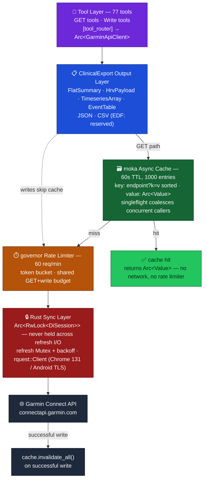

# Garmin MCP Server (Rust)

A [Model Context Protocol (MCP)](https://modelcontextprotocol.io) server that connects Claude and other MCP clients to Garmin Connect, exposing your fitness and health data through **77 tools** across all major Garmin Connect features.

Written in Rust for a single-binary deployment with no runtime dependencies.

Runs as one **HTTP daemon** (`axum` + `rmcp`'s Streamable HTTP transport) rather than a stdio subprocess per client — start it once, then point every MCP client (Claude Desktop, Cursor, a ZeroClaw agent, …) at the same `http://127.0.0.1:8210/mcp` URL. One process, one Garmin login, one moka cache and rate limiter shared by all of them.

---

## Why Rust?

| | Python version | This (Rust) |
|---|---|---|
| **Deployment** | Requires Python 3.12 + uv/pip | Single static binary |
| **Startup** | ~3–5 s (import + venv) | ~3–5 s (OAuth only) |
| **Session safety** | GIL + race conditions under async | `Arc<RwLock<DiSession>>` + refresh mutex at the type level |
| **Duplicate queries** | Each tool independently calls Garmin | moka TTL cache + singleflight coalesces repeats |
| **Rate limiting** | None — burst traffic can trigger Garmin lockout | governor token-bucket, shared across all traffic |
| **Research output** | JSON only | JSON (default) + CSV (single-day & multi-day ranges) + EDF-ready trait |
| **Memory** | ~50 MB | ~5 MB |
| **Binary size** | N/A | ~10 MB (release) |

The session-sharing design is where Rust's concurrency model matters most: the DI OAuth2 session lives in one `Arc<RwLock<DiSession>>`, so GET and POST/DELETE alike take the read lock while a token refresh takes the write lock — and that lock is never held across the refresh network call; a separate refresh mutex serialises refreshers so concurrent callers make one refresh, not N. A single impersonated `rquest::Client` (Chrome 131 / Android TLS emulation, shared cookie jar and connection pool) carries every request — guaranteeing you never accidentally create a second OAuth session.

On top of that, a **moka async cache** (60 s TTL) sits in front of every GET: cache hits return immediately without touching the rate limiter or the network, and concurrent callers for the same key share one in-flight fetch (singleflight). A **governor rate limiter** (60 req/min, configurable) gates both read and write paths so sustained LLM usage stays within Garmin's undocumented limits.

---

## Tool Coverage

**77 tools** across 12 modules:

| Module | Tools | Highlights |
|--------|------:|---|
| Activities | 14 | by-date, splits, typed-splits, weather, HR zones, exercise sets, training effect, gear |
| Health & Wellness | 21 | stats, sleep, HR, stress, body battery, HRV, SpO2, floors, respiration, fitness age, hydration |
| Training & Performance | 3 | training status, weekly progress, race predictions |
| Workouts | 5 | list, get, scheduled, delete, schedule |
| **Research / Longitudinal** | **4** | **multi-day stats/sleep/HRV datasets (up to 366 days); ISO-week statistical summaries** |
| Challenges & Badges | 8 | earned badges, badge challenges, ad-hoc challenges, goals, personal records |
| Devices | 6 | list, last used, settings, primary, solar data, alarms |
| Gear | 3 | list, add to activity, remove from activity |
| User Profile | 4 | profile, settings, full name, unit system |
| Women's Health | 3 | menstrual day/calendar, pregnancy summary |
| Nutrition | 3 | food log, settings, custom foods |
| Data Management | 3 | log hydration, record blood pressure, record body composition |

### Intentionally omitted

- `get_activity_details` — returns 50–500 KB GPS track data; use `get_activity` for summaries
- `delete_activity` — destructive, irreversible

---

## Research Output Formats

### Single-day clinical tools

Ten tools accept an optional `format` parameter for per-day queries:

| format | shape | best for |
|--------|-------|---------|
| `"json"` | pretty-printed object (default) | LLM chat, quick inspection |
| `"csv"` | header + row(s) | statistical batch processing; `cat day1.csv day2.csv \| sort` |

| Tool | CSV shape |
|------|-----------|
| `get_stats` | 1 summary row (28 fields) |
| `get_sleep_summary` | 1 summary row (stages, SpO2, respiration scores) |
| `get_daily_heart_rate` | 1 summary row (resting / min / max HR + sample count) |
| `get_stress_summary` | 1 summary row (avg/max stress + sample counts) |
| `get_body_battery_summary` | `timestamp_ms, body_battery` — one row per event |
| `get_hrv_data` | `reading_time_gmt, hrv_value` — one row per 5-min reading |
| `get_respiration_data` | 1 summary row (waking / sleep BPM) |
| `get_spo2_data` | 1 summary row (avg / lowest / sleep SpO2) |
| `get_blood_pressure` | one row per measurement (timestamp, systolic, diastolic, pulse) |
| `get_daily_weigh_ins` | one row per weigh-in (date, weight, BMI, body fat, …) |

### Longitudinal research tools (up to 366 days per call)

Four dedicated research tools return multi-day datasets in a single call — designed for pandas, R, or any time-series pipeline:

| Tool | JSON | CSV | Columns |
|------|------|-----|---------|
| `get_daily_stats_range` | array of daily objects | header + 1 row per day | 20 (steps, calories, HR, stress, body battery, SpO2, respiration …) |
| `get_sleep_range` | array of daily objects | header + 1 row per day | 16 (total/deep/light/REM/awake seconds, SpO2, respiration, stress, awake count …) |
| `get_hrv_range` | array of daily objects | header + 1 row per day | 9 (weekly avg, last night, 5-min high/low, baseline, status, feedback) |
| `get_weekly_summary` | array of weekly objects | — (JSON only) | week, week_start, week_end, days_with_data + mean/std/min/max × 12 metrics |

Days with no data appear as date-only rows (the time series is never truncated).

```jsonc
// 90-day health panel — paste into pandas
{ "tool": "get_daily_stats_range",
  "arguments": { "start_date": "2026-01-26", "end_date": "2026-04-25", "format": "csv" } }

// 30-day sleep trends
{ "tool": "get_sleep_range",
  "arguments": { "start_date": "2026-03-26", "end_date": "2026-04-25", "format": "json" } }

// HRV autonomic trends
{ "tool": "get_hrv_range",
  "arguments": { "start_date": "2026-03-26", "end_date": "2026-04-25", "format": "csv" } }

// Weekly training load summary (ISO weeks)
{ "tool": "get_weekly_summary",
  "arguments": { "start_date": "2026-01-01", "end_date": "2026-04-25" } }
```

**EDF** (European Data Format for biosignals) is designed but not yet shipped — it needs a binary output policy decision (temp-file path vs base64) and an EDF crate evaluation. The `ClinicalExport` trait in `tools/output.rs` is where it will land.

---

## Requirements

- Rust toolchain (`rustup` + stable) — for building from source
- A Garmin Connect account
- `GARMIN_EMAIL` and `GARMIN_PASSWORD` environment variables

> **MFA note:** MFA accounts are supported. When Garmin asks for a code, the server takes it from `GARMIN_MFA_CODE`, or from the file named by `GARMIN_MFA_CODE_FILE` (polled for up to 5 minutes — the way to feed a code to a non-interactive or agent-driven run), or by prompting on stdin if neither is set. A successful login is cached in `.di_session.json`, so MFA is only needed on the first start and again when the refresh token expires.

---

## Installation

### Build from source

```bash
git clone <this-repo>
cd garmin_mcp_rust
cargo build --release
# Binary at: target/release/garmin-mcp
```

### Install to PATH

```bash
cargo install --path .
# Binary installed to ~/.cargo/bin/garmin-mcp
```

---

## Running

The binary always serves MCP over **Streamable HTTP** — there is no stdio mode. It authenticates once at startup, then listens on `127.0.0.1:$GARMIN_MCP_HTTP_PORT` (default `8210`) at `/mcp`.

```bash
# With credential files (recommended)
GARMIN_EMAIL_FILE=~/.garmin_email GARMIN_PASSWORD_FILE=~/.garmin_password \
  ./target/release/garmin-mcp
# Authenticated. Serving MCP over HTTP on http://127.0.0.1:8210/mcp

# Or with a .env file in the working directory (local dev — see Quick-start below)
./target/release/garmin-mcp

# Custom port
GARMIN_MCP_HTTP_PORT=9000 ./target/release/garmin-mcp
```

Because it's one long-lived process, run it as a background service rather than launching it per-client. On macOS, a `launchd` agent works well:

```xml
<!-- ~/Library/LaunchAgents/com.garmin.mcp.plist -->
<?xml version="1.0" encoding="UTF-8"?>
<!DOCTYPE plist PUBLIC "-//Apple//DTD PLIST 1.0//EN" "http://www.apple.com/DTDs/PropertyList-1.0.dtd">
<plist version="1.0">
<dict>
    <key>Label</key><string>com.garmin.mcp</string>
    <key>EnvironmentVariables</key>
    <dict>
        <key>PATH</key><string>/usr/local/bin:/usr/bin:/bin</string>
        <key>GARMIN_EMAIL_FILE</key><string>/Users/you/.garmin_email</string>
        <key>GARMIN_PASSWORD_FILE</key><string>/Users/you/.garmin_password</string>
        <key>GARMIN_SESSION_FILE</key><string>/Users/you/.garmin_mcp/.garmin_session.json</string>
    </dict>
    <key>ProgramArguments</key>
    <array><string>/Users/you/.cargo/bin/garmin-mcp</string></array>
    <key>RunAtLoad</key><true/>
    <key>KeepAlive</key><true/>
    <key>StandardErrorPath</key><string>/Users/you/.garmin_mcp/logs/daemon.stderr.log</string>
    <key>StandardOutPath</key><string>/Users/you/.garmin_mcp/logs/daemon.stdout.log</string>
</dict>
</plist>
```

```bash
launchctl load ~/Library/LaunchAgents/com.garmin.mcp.plist
# after editing: launchctl unload then launchctl load again to pick up changes
```

On Linux, the equivalent is a `systemd --user` unit with `Environment=` (or `EnvironmentFile=`) lines and `WantedBy=default.target`.

### MCP Inspector

```bash
GARMIN_EMAIL_FILE=~/.garmin_email GARMIN_PASSWORD_FILE=~/.garmin_password \
  ./target/release/garmin-mcp &
npx @modelcontextprotocol/inspector
# In the Inspector UI: Transport = "Streamable HTTP", URL = http://127.0.0.1:8210/mcp
```

---

## Configuration

Every client below just needs the daemon's URL — start `garmin-mcp` once (see **Running** above), then point each client at `http://127.0.0.1:8210/mcp`.

### Claude Desktop

Edit `~/Library/Application Support/Claude/claude_desktop_config.json` (macOS) or `%APPDATA%\Claude\claude_desktop_config.json` (Windows):

```json
{
  "mcpServers": {
    "garmin": {
      "url": "http://127.0.0.1:8210/mcp"
    }
  }
}
```

### Cursor / other MCP clients

Same `"url"`-based shape; consult your client's docs for its remote/HTTP MCP server config, and for the config file location.

### ZeroClaw

[ZeroClaw](https://github.com/zeroclaw-labs/zeroclaw.git) agents are configured via a per-instance `config.toml`. Point the `[[mcp.servers]]` block at the daemon's URL, then bundle it and grant it to an agent:

```toml
[[mcp.servers]]
name = "garmin"
transport = "http"
url = "http://127.0.0.1:8210/mcp"
tool_timeout_secs = 60

[mcp_bundles.garmin]
servers = ["garmin"]

[agents.default]
mcp_bundles = ["garmin"]              # append to whatever bundles the agent already has
```

No credentials belong in `config.toml` at all — the daemon holds its own Garmin session, authenticated once from the `GARMIN_EMAIL_FILE` / `GARMIN_PASSWORD_FILE` in its launchd/systemd unit (see **Running**). This also means every ZeroClaw instance (and Claude Desktop, and anything else) that points at the same URL shares one Garmin login instead of each doing its own.

The 70 read-only `get_*` tools are safe to auto-approve in the instance's risk profile (write tools — `add_hydration_data`, `set_blood_pressure`, `add_body_composition`, `schedule_workout`, `delete_scheduled_workout`, gear add/remove — are worth leaving on manual approval):

```toml
[risk_profiles.default]
auto_approve = [
    # ...existing entries...
    "garmin__get_stats", "garmin__get_sleep_summary", "garmin__get_hrv_data",
    "garmin__get_daily_stats_range", "garmin__get_sleep_range", "garmin__get_hrv_range",
    # ...remaining garmin__get_* tools
]
```

Example: a ZeroClaw health agent using the Garmin MCP tools to analyze several days of activity, stress, and Body Battery data over Discord:


### Display name override

Some health tools (stats, sleep, heart rate, RHR) require your Garmin display name. The server auto-detects it at startup, but you can override it explicitly in the daemon's own environment (not the client config):

```
GARMIN_DISPLAY_NAME=your_garmin_handle
```

---

## Quick-start: `.env` file

For local development and smoke-testing, create a `.env` file in the project root (already in `.gitignore`, and `chmod 600` it — it holds a plaintext password):

```
GARMIN_EMAIL=you@example.com
GARMIN_PASSWORD=your_password
# Optional — override the auto-detected Garmin handle:
# GARMIN_DISPLAY_NAME=your_handle
```

The binary loads `.env` from its **working directory** at startup via `dotenvy` — so `cd` into the project before running it this way. Existing process environment variables always win, so `GARMIN_EMAIL=x cargo run` still overrides the file. For anything long-running, prefer the credential-file + launchd/systemd setup in **Running** — a background service's working directory isn't guaranteed to be the repo, so `.env` won't reliably reach it.

---

## Environment Variables

| Variable | Required | Description |
|---|---|---|
| `GARMIN_EMAIL` | ✅ (or `_FILE`) | Garmin Connect email |
| `GARMIN_EMAIL_FILE` | ✅ (or direct) | Path to file containing email |
| `GARMIN_PASSWORD` | ✅ (or `_FILE`) | Garmin Connect password |
| `GARMIN_PASSWORD_FILE` | ✅ (or direct) | Path to file containing password |
| `GARMIN_MCP_HTTP_PORT` | optional | Port the HTTP MCP server listens on (default `8210`) |
| `GARMIN_DISPLAY_NAME` | optional | Override auto-detected display name |
| `GARMIN_SERVICE_TICKET` | optional | Pre-obtained SSO service ticket — exchanged directly for a DI session, skipping the login page |
| `GARMIN_MFA_CODE` | optional | MFA code, for accounts with MFA enabled |
| `GARMIN_MFA_CODE_FILE` | optional | Path to a file polled for up to 5 minutes for an MFA code (non-interactive / agent runs) |
| `GARMIN_SESSION_FILE` | optional | Override the cached-session path (default: `.di_session.json` in the working directory) |

Any of these set to an **empty** string counts as unset — the server falls through to the `_FILE` variant or the interactive prompt, as if the variable were absent.

---

## Usage Examples

Once connected in Claude, you can ask:

```
"Show me my last 5 activities"
"What was my sleep like on April 20th?"
"How's my body battery been this week?"
"Show me the HR zone breakdown for activity 12345678"
"What are my race time predictions?"
"List my upcoming scheduled workouts"
"What gear do I have registered?"
"Log 500ml of water for today"
```

For researchers:
- "Give me the last 30 days of sleep data as CSV so I can import it into pandas."
- "Show me a weekly summary of my training load over the past 3 months."
- "Export 90 days of HRV data for autonomic nervous system analysis."

### Tool reference

All tools accept JSON arguments. Clinical tools also accept an optional `"format"` field (`"json"` or `"csv"`).

```jsonc
// Activities
{ "tool": "get_recent_activities",        "arguments": { "limit": 10 } }
{ "tool": "get_activities_by_date",       "arguments": { "start_date": "2026-04-01", "end_date": "2026-04-25" } }
{ "tool": "get_activity_splits",          "arguments": { "activity_id": "12345678" } }
{ "tool": "get_activity_hr_in_timezones", "arguments": { "activity_id": "12345678" } }

// Health — JSON (default)
{ "tool": "get_stats",          "arguments": { "date": "2026-04-25" } }
{ "tool": "get_sleep_summary",  "arguments": { "date": "2026-04-25" } }
{ "tool": "get_hrv_data",       "arguments": { "date": "2026-04-25" } }
{ "tool": "get_blood_pressure", "arguments": { "start_date": "2026-04-01", "end_date": "2026-04-25" } }
{ "tool": "get_daily_steps",    "arguments": { "start_date": "2026-04-18", "end_date": "2026-04-25" } }

// Health — CSV for batch / statistical use
{ "tool": "get_stats",                 "arguments": { "date": "2026-04-25", "format": "csv" } }
{ "tool": "get_hrv_data",              "arguments": { "date": "2026-04-25", "format": "csv" } }
{ "tool": "get_body_battery_summary",  "arguments": { "date": "2026-04-25", "format": "csv" } }
{ "tool": "get_blood_pressure",        "arguments": { "start_date": "2026-01-01", "end_date": "2026-04-25", "format": "csv" } }

// Training
{ "tool": "get_training_status",               "arguments": { "date": "2026-04-25" } }
{ "tool": "get_progress_summary_between_dates", "arguments": { "start_date": "2026-04-01", "end_date": "2026-04-25" } }
{ "tool": "get_race_predictions",              "arguments": {} }

// Write operations
{ "tool": "add_hydration_data",   "arguments": { "date": "2026-04-25", "value_in_ml": 500 } }
{ "tool": "set_blood_pressure",   "arguments": { "date": "2026-04-25", "systolic": 120, "diastolic": 80, "pulse": 65 } }
{ "tool": "add_body_composition", "arguments": { "date": "2026-04-25", "weight_kg": 72.5 } }
{ "tool": "schedule_workout",     "arguments": { "workout_id": "987654", "date": "2026-04-27" } }

// Longitudinal research — multi-day datasets
{ "tool": "get_daily_stats_range", "arguments": { "start_date": "2026-01-26", "end_date": "2026-04-25", "format": "csv" } }
{ "tool": "get_sleep_range",       "arguments": { "start_date": "2026-03-26", "end_date": "2026-04-25", "format": "json" } }
{ "tool": "get_hrv_range",         "arguments": { "start_date": "2026-03-26", "end_date": "2026-04-25", "format": "csv" } }
{ "tool": "get_weekly_summary",    "arguments": { "start_date": "2026-01-01", "end_date": "2026-04-25" } }
```

---

## Connection Test

`tests/connection.rs` performs a real OAuth login against Garmin Connect using
the same code path as `main.rs`. It's `#[ignore]`d by default (it hits the
network and needs real credentials), so it never runs during normal `cargo
test` / CI — run it explicitly to verify your setup:

```bash
# Credentials from .env (simplest)
cargo test --test connection -- --ignored --nocapture

# Or pass inline
GARMIN_EMAIL=you@example.com GARMIN_PASSWORD=secret \
  cargo test --test connection -- --ignored --nocapture
```

A successful run prints `Logged in as: <handle>` (or a warning if the display
name couldn't be resolved); a failure panics with the underlying error, e.g.
bad credentials or a Garmin API change.

---

## Architecture

```
src/
├── main.rs          — thin binary entrypoint: load .env, authenticate, serve MCP over HTTP (axum + StreamableHttpService, GARMIN_MCP_HTTP_PORT)
├── lib.rs           — library root (pub mod auth/client/di_auth/tools), used by main.rs and tests/
├── auth.rs          — server wiring: builds the shared client, authenticates, resolves display name
├── di_auth.rs       — DI OAuth2: SSO + MFA login, service-ticket exchange, token refresh, session cache
├── client.rs        — GarminApiClient (moka cache + governor rate limit + token refresh)
└── tools/
    ├── mod.rs           — GarminMcpServer + #[tool_router] (all 77 tools registered here)
    ├── output.rs        — ClinicalExport trait: FlatSummary / HrvPayload / TimeseriesArray / EventTable
    ├── activities.rs    — 14 tools
    ├── health_wellness.rs — 21 tools (10 with format=csv)
    ├── research.rs      — 4 longitudinal research tools (date-range datasets + weekly stats)
    ├── training.rs      —  3 tools
    ├── workouts.rs      —  5 tools
    ├── challenges.rs    —  8 tools
    ├── devices.rs       —  6 tools
    ├── gear.rs          —  3 tools
    ├── user_profile.rs  —  4 tools
    ├── womens_health.rs —  3 tools
    ├── nutrition.rs     —  3 tools
    └── data_management.rs —  3 tools (POST)
```

### GET pipeline (`client.rs`)



Write path (POST / PUT / DELETE) skips the cache, goes through the same rate limiter, then rquest with the bearer token read out of `Arc<RwLock<DiSession>>`. Successful writes call `cache.invalidate_all()` so the next GET sees fresh data.

### Session layers

```
Arc<RwLock<DiSession>>          — DI OAuth2 session (access token ~24 h,
                                  refresh token ~30 d), shared by reads and
                                  writes.
                                  Requests hold the read lock; a refresh takes
                                  the write lock only to store the new session —
                                  never across the network call.

Mutex<RefreshState>             — serialises refreshers, so concurrent callers
                                  make one refresh instead of N, and carries the
                                  exponential backoff (30 s … 15 min) after a
                                  failed refresh.

rquest::Client (struct field)   — one impersonated HTTP client (Chrome 131 /
                                  Android TLS + HTTP2 emulation), shared across
                                  every read and write; reuses the cookie jar the
                                  SSO login warmed up plus the TCP/TLS pool.
                                  A separate plain client handles diauth.garmin.com
                                  token exchange and refresh.
```

---

## Known Limitations

- **Refresh token expiry** — the DI access token (~24 hours, per Garmin's `expires_in`) is refreshed in-process and the new session is written back to `.di_session.json`, so a long-running server keeps working without a restart. The refresh token itself lasts ~30 days; once it expires, the next start needs a fresh SSO login (and an MFA code, if the account requires one).
- **Sessions are bound to one account** — a cached session records the email it was minted for. Changing `GARMIN_EMAIL` invalidates it and forces a fresh login, so a stale session can never serve the previous account's data.
- **Write operations unverified** — POST/DELETE tools (`data_management`, `gear write`, `workouts write`) use correct endpoints but have not been end-to-end tested against a live account.
- **Non-public API** — Garmin Connect has no official public API. Endpoints are derived from community reverse-engineering and may change without notice.
- **Account-gated features** — Tools for workout library, training readiness, nutrition logging, menstrual/pregnancy tracking, body battery events, and goals return a friendly "no data" message when the account or device does not support the feature. `isError` is always `false`; the API signal (e.g. `HTTP 404` or `NotAllowedException`) is included in the message for diagnostics.

---

## Phase 6 (Planned)

- **China region** — `GARMIN_IS_CN=true` switches to `connect.garmin.cn`
- **`garmin-mcp-auth` binary** — standalone one-time auth helper (mirrors the Python `garmin-mcp-auth` command)

---

## Acknowledgements

This project is a Rust port of [**garmin_mcp**](https://github.com/Taxuspt/garmin_mcp) by [@Taxuspt](https://github.com/Taxuspt).

The original Python implementation established the tool taxonomy, endpoint mapping, and field-curation design that this port follows. The intentionally-omitted endpoints, the display-name resolution strategy, and the overall MCP tool structure are all derived from that prior work.

---


