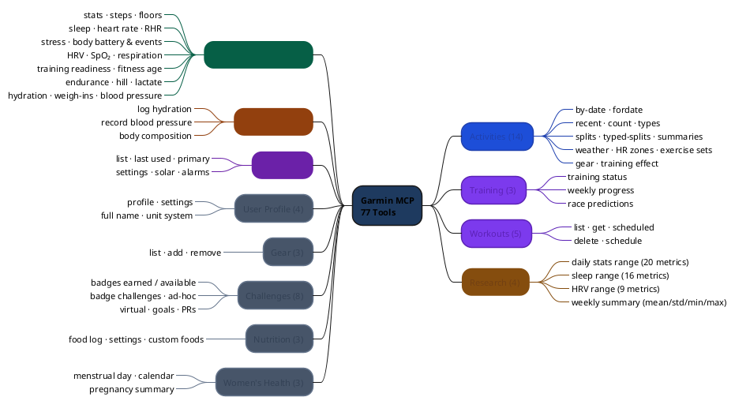

# Garmin MCP Server (Rust)

A [Model Context Protocol (MCP)](https://modelcontextprotocol.io) server that connects Claude and other MCP clients to Garmin Connect, exposing your fitness and health data through **77 tools** across all major Garmin Connect features.

Written in Rust for a single-binary deployment with no runtime dependencies.

---

## Why Rust?

| | Python version | This (Rust) |
|---|---|---|
| **Deployment** | Requires Python 3.12 + uv/pip | Single static binary |
| **Startup** | ~3–5 s (import + venv) | ~3–5 s (OAuth only) |
| **Session safety** | GIL + race conditions under async | `Mutex` / `RwLock` at the type level |
| **Duplicate queries** | Each tool independently calls Garmin | moka TTL cache + singleflight coalesces repeats |
| **Rate limiting** | None — burst traffic can trigger Garmin lockout | governor token-bucket, shared across all traffic |
| **Research output** | JSON only | JSON (default) + CSV (single-day & multi-day ranges) + EDF-ready trait |
| **Memory** | ~50 MB | ~5 MB |
| **Binary size** | N/A | ~10 MB (release) |

The session-sharing design is where Rust's concurrency model matters most: all GET requests are serialised through a single `Mutex<GarminClient>` (Garmin rate-limits per session token), while concurrent POST/DELETE operations share a `RwLock<BearerToken>` and a single pooled `reqwest::Client` — guaranteeing you never accidentally create a second OAuth session.

On top of that, a **moka async cache** (60 s TTL) sits in front of every GET: cache hits return immediately without touching the Mutex or the network, and concurrent callers for the same key share one in-flight fetch (singleflight). A **governor rate limiter** (60 req/min, configurable) gates both read and write paths so sustained LLM usage stays within Garmin's undocumented limits.

---

## Tool Coverage

**77 tools** across 12 modules:



| Module | Tools | Highlights |
|--------|------:|---|
| Activities | 14 | by-date, splits, typed-splits, weather, HR zones, exercise sets, training effect, gear |
| Health & Wellness | 21 | stats, sleep, HR, stress, body battery, HRV, SpO2, floors, respiration, fitness age, hydration |
| Training & Performance | 3 | training status, weekly progress, race predictions |
| Workouts | 5 | list, get, scheduled, delete, schedule |
| **Research / Longitudinal** | **4** | **multi-day stats/sleep/HRV datasets (up to 366 days); ISO-week statistical summaries** |
| Challenges & Badges | 8 | earned badges, badge challenges, ad-hoc challenges, goals, personal records |
| Devices | 6 | list, last used, settings, primary, solar data, alarms |
| Gear | 3 | list, add to activity, remove from activity |
| User Profile | 4 | profile, settings, full name, unit system |
| Women's Health | 3 | menstrual day/calendar, pregnancy summary |
| Nutrition | 3 | food log, settings, custom foods |
| Data Management | 3 | log hydration, record blood pressure, record body composition |

### Intentionally omitted

- `get_activity_details` — returns 50–500 KB GPS track data; use `get_activity` for summaries
- `delete_activity` — destructive, irreversible

---

## Research Output Formats

### Single-day clinical tools

Ten tools accept an optional `format` parameter for per-day queries:

| format | shape | best for |
|--------|-------|---------|
| `"json"` | pretty-printed object (default) | LLM chat, quick inspection |
| `"csv"` | header + row(s) | statistical batch processing; `cat day1.csv day2.csv \| sort` |

| Tool | CSV shape |
|------|-----------|
| `get_stats` | 1 summary row (28 fields) |
| `get_sleep_summary` | 1 summary row (stages, SpO2, respiration scores) |
| `get_daily_heart_rate` | 1 summary row (resting / min / max HR + sample count) |
| `get_stress_summary` | 1 summary row (avg/max stress + sample counts) |
| `get_body_battery_summary` | `timestamp_ms, body_battery` — one row per event |
| `get_hrv_data` | `reading_time_gmt, hrv_value` — one row per 5-min reading |
| `get_respiration_data` | 1 summary row (waking / sleep BPM) |
| `get_spo2_data` | 1 summary row (avg / lowest / sleep SpO2) |
| `get_blood_pressure` | one row per measurement (timestamp, systolic, diastolic, pulse) |
| `get_daily_weigh_ins` | one row per weigh-in (date, weight, BMI, body fat, …) |

### Longitudinal research tools (up to 366 days per call)

Four dedicated research tools return multi-day datasets in a single call — designed for pandas, R, or any time-series pipeline:

| Tool | JSON | CSV | Columns |
|------|------|-----|---------|
| `get_daily_stats_range` | array of daily objects | header + 1 row per day | 20 (steps, calories, HR, stress, body battery, SpO2, respiration …) |
| `get_sleep_range` | array of daily objects | header + 1 row per day | 16 (total/deep/light/REM/awake seconds, SpO2, respiration, stress, awake count …) |
| `get_hrv_range` | array of daily objects | header + 1 row per day | 9 (weekly avg, last night, 5-min high/low, baseline, status, feedback) |
| `get_weekly_summary` | array of weekly objects | — (JSON only) | week, week_start, week_end, days_with_data + mean/std/min/max × 12 metrics |

Days with no data appear as date-only rows (the time series is never truncated).

```jsonc
// 90-day health panel — paste into pandas
{ "tool": "get_daily_stats_range",
  "arguments": { "start_date": "2026-01-26", "end_date": "2026-04-25", "format": "csv" } }

// 30-day sleep trends
{ "tool": "get_sleep_range",
  "arguments": { "start_date": "2026-03-26", "end_date": "2026-04-25", "format": "json" } }

// HRV autonomic trends
{ "tool": "get_hrv_range",
  "arguments": { "start_date": "2026-03-26", "end_date": "2026-04-25", "format": "csv" } }

// Weekly training load summary (ISO weeks)
{ "tool": "get_weekly_summary",
  "arguments": { "start_date": "2026-01-01", "end_date": "2026-04-25" } }
```

**EDF** (European Data Format for biosignals) is designed but not yet shipped — it needs a binary output policy decision (temp-file path vs base64) and an EDF crate evaluation. The `ClinicalExport` trait in `tools/output.rs` is where it will land.

---

## Requirements

- Rust toolchain (`rustup` + stable) — for building from source
- A Garmin Connect account
- `GARMIN_EMAIL` and `GARMIN_PASSWORD` environment variables

> **MFA note:** `garmin_client 0.2` does not support interactive MFA prompts. If your account has MFA enabled, you may need to temporarily disable it or use an app-password equivalent. This is a known upstream limitation tracked in [Phase 5](#phase-5-planned).

---

## Installation

### Build from source

```bash
git clone <this-repo>
cd garmin_mcp_rust
cargo build --release
# Binary at: target/release/garmin-mcp
```

### Install to PATH

```bash
cargo install --path .
# Binary installed to ~/.cargo/bin/garmin-mcp
```

---

## Configuration

### Claude Desktop

Edit `~/Library/Application Support/Claude/claude_desktop_config.json` (macOS) or `%APPDATA%\Claude\claude_desktop_config.json` (Windows):

```json
{
  "mcpServers": {
    "garmin": {
      "command": "/path/to/garmin-mcp",
      "env": {
        "GARMIN_EMAIL": "you@example.com",
        "GARMIN_PASSWORD": "your_password"
      }
    }
  }
}
```

Or use credential files (recommended — keeps secrets out of the config file):

```bash
echo "you@example.com" > ~/.garmin_email
echo "your_password"   > ~/.garmin_password
chmod 600 ~/.garmin_email ~/.garmin_password
```

```json
{
  "mcpServers": {
    "garmin": {
      "command": "/path/to/garmin-mcp",
      "env": {
        "GARMIN_EMAIL_FILE": "/Users/you/.garmin_email",
        "GARMIN_PASSWORD_FILE": "/Users/you/.garmin_password"
      }
    }
  }
}
```

### Cursor / other MCP clients

Same JSON structure; consult your client's MCP server configuration docs for the config file location.

### Display name override

Some health tools (stats, sleep, heart rate, RHR) require your Garmin display name. The server auto-detects it at startup, but you can override it explicitly:

```json
"env": {
  "GARMIN_EMAIL": "...",
  "GARMIN_PASSWORD": "...",
  "GARMIN_DISPLAY_NAME": "your_garmin_handle"
}
```

---

## Quick-start: `.env` file

For local development and smoke-testing, create a `.env` file in the project root (already in `.gitignore`):

```
GARMIN_EMAIL=you@example.com
GARMIN_PASSWORD=your_password
# Optional — override the auto-detected Garmin handle:
# GARMIN_DISPLAY_NAME=your_handle
```

The binary loads `.env` at startup via `dotenvy`. Existing process environment variables always win, so `GARMIN_EMAIL=x cargo run` still overrides the file.

---

## Environment Variables

| Variable | Required | Description |
|---|---|---|
| `GARMIN_EMAIL` | ✅ (or `_FILE`) | Garmin Connect email |
| `GARMIN_EMAIL_FILE` | ✅ (or direct) | Path to file containing email |
| `GARMIN_PASSWORD` | ✅ (or `_FILE`) | Garmin Connect password |
| `GARMIN_PASSWORD_FILE` | ✅ (or direct) | Path to file containing password |
| `GARMIN_DISPLAY_NAME` | optional | Override auto-detected display name |

---

## Running

```bash
# With .env file in project root (recommended for local dev)
echo "GARMIN_EMAIL=you@example.com" >> .env
echo "GARMIN_PASSWORD=secret"       >> .env
./target/release/garmin-mcp

# Inline env vars (override .env)
GARMIN_EMAIL=you@example.com GARMIN_PASSWORD=secret ./target/release/garmin-mcp

# With credential files (recommended for production)
GARMIN_EMAIL_FILE=~/.garmin_email GARMIN_PASSWORD_FILE=~/.garmin_password \
  ./target/release/garmin-mcp
```

### MCP Inspector

```bash
GARMIN_EMAIL=... GARMIN_PASSWORD=... \
  npx @modelcontextprotocol/inspector ./target/release/garmin-mcp
```

---

## Usage Examples

Once connected in Claude, you can ask:

```
"Show me my last 5 activities"
"What was my sleep like on April 20th?"
"How's my body battery been this week?"
"Show me the HR zone breakdown for activity 12345678"
"What are my race time predictions?"
"List my upcoming scheduled workouts"
"What gear do I have registered?"
"Log 500ml of water for today"
```

For researchers:
- "Give me the last 30 days of sleep data as CSV so I can import it into pandas."
- "Show me a weekly summary of my training load over the past 3 months."
- "Export 90 days of HRV data for autonomic nervous system analysis."

### Tool reference

All tools accept JSON arguments. Clinical tools also accept an optional `"format"` field (`"json"` or `"csv"`).

```jsonc
// Activities
{ "tool": "get_recent_activities",        "arguments": { "limit": 10 } }
{ "tool": "get_activities_by_date",       "arguments": { "start_date": "2026-04-01", "end_date": "2026-04-25" } }
{ "tool": "get_activity_splits",          "arguments": { "activity_id": "12345678" } }
{ "tool": "get_activity_hr_in_timezones", "arguments": { "activity_id": "12345678" } }

// Health — JSON (default)
{ "tool": "get_stats",          "arguments": { "date": "2026-04-25" } }
{ "tool": "get_sleep_summary",  "arguments": { "date": "2026-04-25" } }
{ "tool": "get_hrv_data",       "arguments": { "date": "2026-04-25" } }
{ "tool": "get_blood_pressure", "arguments": { "start_date": "2026-04-01", "end_date": "2026-04-25" } }
{ "tool": "get_daily_steps",    "arguments": { "start_date": "2026-04-18", "end_date": "2026-04-25" } }

// Health — CSV for batch / statistical use
{ "tool": "get_stats",                 "arguments": { "date": "2026-04-25", "format": "csv" } }
{ "tool": "get_hrv_data",              "arguments": { "date": "2026-04-25", "format": "csv" } }
{ "tool": "get_body_battery_summary",  "arguments": { "date": "2026-04-25", "format": "csv" } }
{ "tool": "get_blood_pressure",        "arguments": { "start_date": "2026-01-01", "end_date": "2026-04-25", "format": "csv" } }

// Training
{ "tool": "get_training_status",               "arguments": { "date": "2026-04-25" } }
{ "tool": "get_progress_summary_between_dates", "arguments": { "start_date": "2026-04-01", "end_date": "2026-04-25" } }
{ "tool": "get_race_predictions",              "arguments": {} }

// Write operations
{ "tool": "add_hydration_data",   "arguments": { "date": "2026-04-25", "value_in_ml": 500 } }
{ "tool": "set_blood_pressure",   "arguments": { "date": "2026-04-25", "systolic": 120, "diastolic": 80, "pulse": 65 } }
{ "tool": "add_body_composition", "arguments": { "date": "2026-04-25", "weight_kg": 72.5 } }
{ "tool": "schedule_workout",     "arguments": { "workout_id": "987654", "date": "2026-04-27" } }

// Longitudinal research — multi-day datasets
{ "tool": "get_daily_stats_range", "arguments": { "start_date": "2026-01-26", "end_date": "2026-04-25", "format": "csv" } }
{ "tool": "get_sleep_range",       "arguments": { "start_date": "2026-03-26", "end_date": "2026-04-25", "format": "json" } }
{ "tool": "get_hrv_range",         "arguments": { "start_date": "2026-03-26", "end_date": "2026-04-25", "format": "csv" } }
{ "tool": "get_weekly_summary",    "arguments": { "start_date": "2026-01-01", "end_date": "2026-04-25" } }
```

---

## Connection Test

`tests/connection.rs` performs a real OAuth login against Garmin Connect using
the same code path as `main.rs`. It's `#[ignore]`d by default (it hits the
network and needs real credentials), so it never runs during normal `cargo
test` / CI — run it explicitly to verify your setup:

```bash
# Credentials from .env (simplest)
cargo test --test connection -- --ignored --nocapture

# Or pass inline
GARMIN_EMAIL=you@example.com GARMIN_PASSWORD=secret \
  cargo test --test connection -- --ignored --nocapture
```

A successful run prints `Logged in as: <handle>` (or a warning if the display
name couldn't be resolved); a failure panics with the underlying error, e.g.
bad credentials or a Garmin API change.

---

## Architecture

```
src/
├── main.rs          — thin binary entrypoint: load .env, OAuth, stdio transport
├── lib.rs           — library root (pub mod auth/client/tools), used by main.rs and tests/
├── auth.rs          — OAuth login, display-name resolution, session file read
├── client.rs        — GarminApiClient (cache + rate-limit + three-layer sync)
└── tools/
    ├── mod.rs           — GarminMcpServer + #[tool_router] (all 77 tools registered here)
    ├── output.rs        — ClinicalExport trait: FlatSummary / HrvPayload / TimeseriesArray / EventTable
    ├── activities.rs    — 14 tools
    ├── health_wellness.rs — 21 tools (10 with format=csv)
    ├── research.rs      — 4 longitudinal research tools (date-range datasets + weekly stats)
    ├── training.rs      —  3 tools
    ├── workouts.rs      —  5 tools
    ├── challenges.rs    —  8 tools
    ├── devices.rs       —  6 tools
    ├── gear.rs          —  3 tools
    ├── user_profile.rs  —  4 tools
    ├── womens_health.rs —  3 tools
    ├── nutrition.rs     —  3 tools
    └── data_management.rs —  3 tools (POST)
```

### GET pipeline (`client.rs`)

<div style="font-family:'Segoe UI',system-ui,sans-serif;max-width:860px;margin:1.5rem auto;background:#f0f7f0;border-radius:12px;padding:24px 20px;border:1px solid #b8d4b8;box-shadow:0 3px 12px rgba(0,50,0,.1)"><h4 style="text-align:center;margin:0 0 16px;font-size:15px;color:#1a3c1a;font-weight:700">🦀 Garmin MCP Rust · GET Request Pipeline</h4><div style="background:#6d28d9;border-radius:8px;padding:12px 16px;color:#fff"><div style="font-weight:600;font-size:11px;letter-spacing:.5px;text-transform:uppercase;opacity:.75;margin-bottom:7px">🔧 Tool Layer · 73 tools</div><div style="display:grid;grid-template-columns:2fr 2fr 2fr 1fr;gap:6px"><div style="background:rgba(255,255,255,.15);border-radius:5px;padding:7px;font-size:10px;text-align:center">GET tools<small style="display:block;opacity:.75;margin-top:2px">health · activity · training</small></div><div style="background:rgba(255,255,255,.15);border-radius:5px;padding:7px;font-size:10px;text-align:center">Write tools<small style="display:block;opacity:.75;margin-top:2px">POST · PUT · DELETE</small></div><div style="background:rgba(255,255,255,.15);border-radius:5px;padding:7px;font-size:10px;text-align:center">#[tool_router]<small style="display:block;opacity:.75;margin-top:2px">GarminMcpServer</small></div><div style="background:rgba(255,255,255,.2);border-radius:5px;padding:7px;font-size:10px;text-align:center;border:1px solid rgba(255,255,255,.35)">Arc&lt;GarminApiClient&gt;</div></div></div><div style="text-align:center;color:#9ca3af;font-size:20px;line-height:1.8">↓</div><div style="background:#1d4ed8;border-radius:8px;padding:12px 16px;color:#fff"><div style="font-weight:600;font-size:11px;letter-spacing:.5px;text-transform:uppercase;opacity:.75;margin-bottom:7px">📋 ClinicalExport Output Layer</div><div style="display:grid;grid-template-columns:repeat(5,1fr);gap:6px"><div style="background:rgba(255,255,255,.15);border-radius:5px;padding:7px 5px;font-size:10px;text-align:center">FlatSummary<small style="display:block;opacity:.75;margin-top:2px">stats · sleep<br>HR · stress · resp</small></div><div style="background:rgba(255,255,255,.15);border-radius:5px;padding:7px 5px;font-size:10px;text-align:center">HrvPayload<small style="display:block;opacity:.75;margin-top:2px">summary +<br>5-min readings</small></div><div style="background:rgba(255,255,255,.15);border-radius:5px;padding:7px 5px;font-size:10px;text-align:center">TimeseriesArray<small style="display:block;opacity:.75;margin-top:2px">[[ts,v], …]<br>body battery</small></div><div style="background:rgba(255,255,255,.15);border-radius:5px;padding:7px 5px;font-size:10px;text-align:center">EventTable<small style="display:block;opacity:.75;margin-top:2px">BP · weigh-ins<br>date-range</small></div><div style="background:rgba(255,255,255,.2);border-radius:5px;padding:7px 5px;font-size:10px;text-align:center;border:1px dashed rgba(255,255,255,.5)"><b>JSON</b> · CSV<small style="display:block;opacity:.8;margin-top:2px">EDF: trait slot<br>reserved</small></div></div></div><div style="text-align:center;color:#9ca3af;font-size:20px;line-height:1.8">↓ <small style="font-size:11px;color:#6b7280">GET path only · writes skip cache ↗</small></div><div style="background:#166534;border-radius:8px;padding:12px 16px;color:#fff"><div style="font-weight:600;font-size:11px;letter-spacing:.5px;text-transform:uppercase;opacity:.75;margin-bottom:7px">🗃️ moka Async Cache</div><div style="display:grid;grid-template-columns:repeat(3,1fr);gap:8px"><div style="background:rgba(255,255,255,.15);border-radius:5px;padding:8px;font-size:10px"><b>TTL Cache</b><small style="display:block;margin-top:3px;opacity:.85;line-height:1.6">60s TTL · 1 000 entries<br>Key: endpoint?k=v sorted<br>Value: Arc&lt;Value&gt;</small></div><div style="background:rgba(255,255,255,.15);border-radius:5px;padding:8px;font-size:10px"><b>Singleflight</b><small style="display:block;margin-top:3px;opacity:.85;line-height:1.6">try_get_with built-in<br>Concurrent callers share<br>one in-flight fetch</small></div><div style="background:rgba(255,255,255,.25);border-radius:5px;padding:8px;font-size:10px;border:1px solid rgba(255,255,255,.3)"><b>Cache Hit ✅</b><small style="display:block;margin-top:3px;opacity:.9;line-height:1.6">Returns Arc&lt;Value&gt;<br>Skips rate-limiter<br>No Mutex · no network</small></div></div></div><div style="text-align:center;color:#9ca3af;font-size:20px;line-height:1.8">↓ <small style="font-size:11px;color:#6b7280">cache miss</small></div><div style="background:#b45309;border-radius:8px;padding:12px 16px;color:#fff"><div style="font-weight:600;font-size:11px;letter-spacing:.5px;text-transform:uppercase;opacity:.75;margin-bottom:7px">⏱️ governor Rate Limiter</div><div style="display:grid;grid-template-columns:repeat(3,1fr);gap:8px"><div style="background:rgba(255,255,255,.15);border-radius:5px;padding:8px;font-size:10px"><b>60 req/min</b><small style="display:block;margin-top:3px;opacity:.85;line-height:1.6">Token bucket algorithm<br>Configurable constant</small></div><div style="background:rgba(255,255,255,.15);border-radius:5px;padding:8px;font-size:10px"><b>Shared Budget</b><small style="display:block;margin-top:3px;opacity:.85;line-height:1.6">GET + POST/PUT/DELETE<br>one limiter for all<br>until_ready().await</small></div><div style="background:rgba(255,255,255,.15);border-radius:5px;padding:8px;font-size:10px"><b>Lockout Guard</b><small style="display:block;margin-top:3px;opacity:.85;line-height:1.6">Prevents Garmin<br>per-session rate-limit<br>abuse and bans</small></div></div></div><div style="text-align:center;color:#9ca3af;font-size:20px;line-height:1.8">↓</div><div style="background:#991b1b;border-radius:8px;padding:12px 16px;color:#fff"><div style="font-weight:600;font-size:11px;letter-spacing:.5px;text-transform:uppercase;opacity:.75;margin-bottom:7px">🔒 Rust Sync Layer</div><div style="display:grid;grid-template-columns:repeat(3,1fr);gap:8px"><div style="background:rgba(255,255,255,.15);border-radius:5px;padding:8px;font-size:10px"><b>Mutex&lt;GarminClient&gt;</b><small style="display:block;margin-top:3px;opacity:.85;line-height:1.6">GET serialization<br>api_request needs &amp;mut self<br>One in-flight at a time</small></div><div style="background:rgba(255,255,255,.15);border-radius:5px;padding:8px;font-size:10px"><b>RwLock&lt;BearerToken&gt;</b><small style="display:block;margin-top:3px;opacity:.85;line-height:1.6">Concurrent reads (writes)<br>Exclusive write (refresh)<br>Double-checked locking</small></div><div style="background:rgba(255,255,255,.15);border-radius:5px;padding:8px;font-size:10px"><b>reqwest::Client</b><small style="display:block;margin-top:3px;opacity:.85;line-height:1.6">Pooled HTTP client<br>Shared across writes<br>Reuses TLS + TCP</small></div></div></div><div style="text-align:center;color:#9ca3af;font-size:20px;line-height:1.8">↓</div><div style="background:#1e293b;border-radius:8px;padding:12px 16px;color:#fff"><div style="font-weight:600;font-size:11px;letter-spacing:.5px;text-transform:uppercase;opacity:.75;margin-bottom:7px">🌐 Garmin Connect API</div><div style="display:grid;grid-template-columns:1fr 1fr;gap:8px"><div style="background:rgba(255,255,255,.1);border-radius:5px;padding:8px;font-size:10px"><b>GET via garmin_client</b><small style="display:block;margin-top:3px;opacity:.85;line-height:1.6">connectapi.garmin.com<br>Mutex-serialized · one at a time<br>Response cached for 60s</small></div><div style="background:rgba(255,255,255,.1);border-radius:5px;padding:8px;font-size:10px"><b>POST/PUT/DELETE via reqwest</b><small style="display:block;margin-top:3px;opacity:.85;line-height:1.6">Bypasses garmin_client Mutex<br>Uses RwLock bearer token<br>On success: cache.invalidate_all()</small></div></div></div></div>

Write path (POST / PUT / DELETE) skips the cache and Mutex, goes through the rate limiter, then reqwest with the pooled `Arc<RwLock<BearerToken>>`. Successful writes call `cache.invalidate_all()` so the next GET sees fresh data.

### Session layers

```
Arc<RwLock<BearerToken>>       — shared token for write operations
                                  multiple POST/DELETE can hold the read lock
                                  concurrently; token refresh acquires the write
                                  lock exclusively (double-checked locking).

reqwest::Client (struct field)  — one HTTP client, shared across all writes;
                                  reuses the TCP connection pool and TLS session.
```

---

## Known Limitations

- **No MFA support** — `garmin_client 0.2` does not expose an interactive MFA prompt. Planned for Phase 6 (upstream fix or local fork).
- **Token refresh** — `garmin_client` does not rewrite `.garmin_session.json` after an in-process token refresh. The refresh architecture is in place; once upstream is fixed it will activate automatically. OAuth tokens are valid for ~1 hour; restart the server if you hit a long session.
- **Write operations unverified** — POST/DELETE tools (`data_management`, `gear write`, `workouts write`) use correct endpoints but have not been end-to-end tested against a live account.
- **Non-public API** — Garmin Connect has no official public API. Endpoints are derived from community reverse-engineering and may change without notice.
- **Account-gated features** — Tools for workout library, training readiness, nutrition logging, menstrual/pregnancy tracking, body battery events, and goals return a friendly "no data" message when the account or device does not support the feature. `isError` is always `false`; the API signal (e.g. `HTTP 404` or `NotAllowedException`) is included in the message for diagnostics.

### Known `garmin_client 0.2.1` bugs (worked around)

1. **URL double-slash** — `add_route()` prepends `/`; endpoints with a leading slash produce `connectapi.garmin.com//path` → 404. Fixed: `trim_start_matches('/')` in `api_json()`.
2. **Token re-quoting** — `retrieve_json_session()` uses `Value::to_string()` on the cached token, wrapping it in extra quotes → 401. Fixed: delete `.garmin_session.json` on every startup (forces fresh OAuth); read the token with `.as_str()` to avoid re-quoting.
3. **GET-only client** — `api_request()` only supports GET. Fixed: POST/DELETE use `reqwest` directly with the bearer token read from the session file.

---

## Phase 6 (Planned)

- **Token persistence** — skip re-login when the cached token is still valid; store session in `~/.garminconnect_rust/session.json`
- **MFA support** — interactive MFA prompt via stderr on first run
- **China region** — `GARMIN_IS_CN=true` switches to `connect.garmin.cn`
- **`garmin-mcp-auth` binary** — standalone one-time auth helper (mirrors the Python `garmin-mcp-auth` command)

---

## Acknowledgements

This project is a Rust port of [**garmin_mcp**](https://github.com/Taxuspt/garmin_mcp) by [@Taxuspt](https://github.com/Taxuspt).

The original Python implementation established the tool taxonomy, endpoint mapping, and field-curation design that this port follows. The intentionally-omitted endpoints, the display-name resolution strategy, and the overall MCP tool structure are all derived from that prior work.

---


